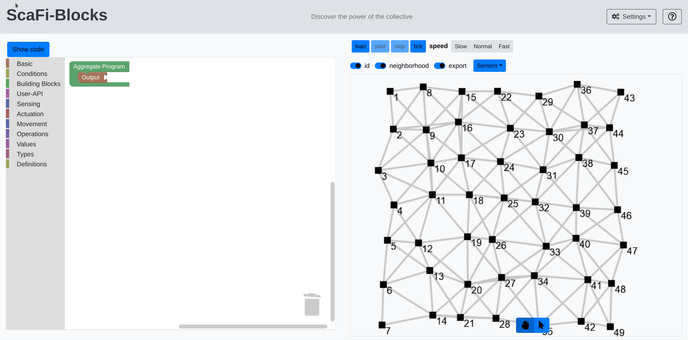
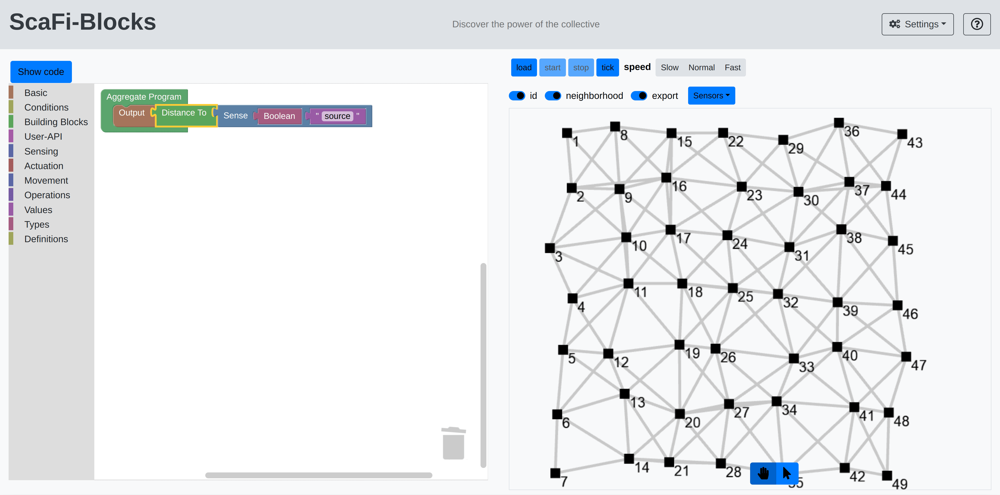
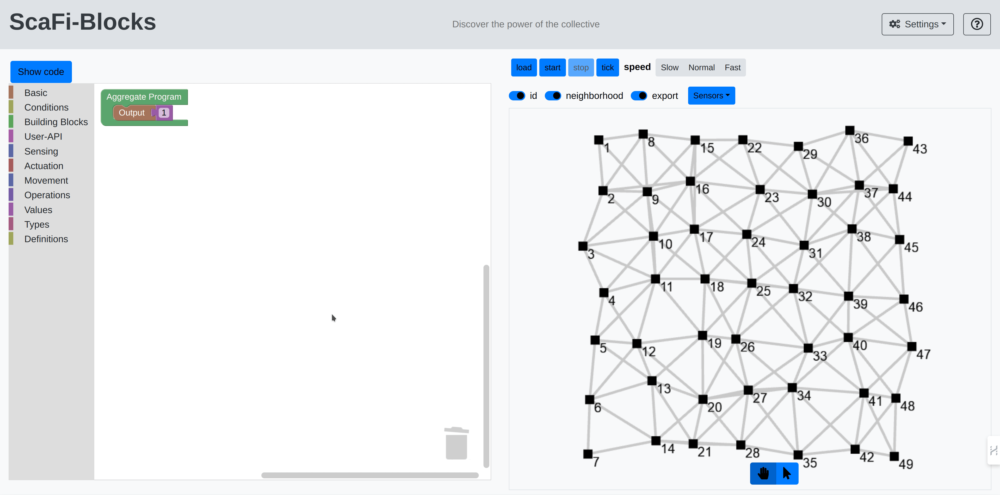
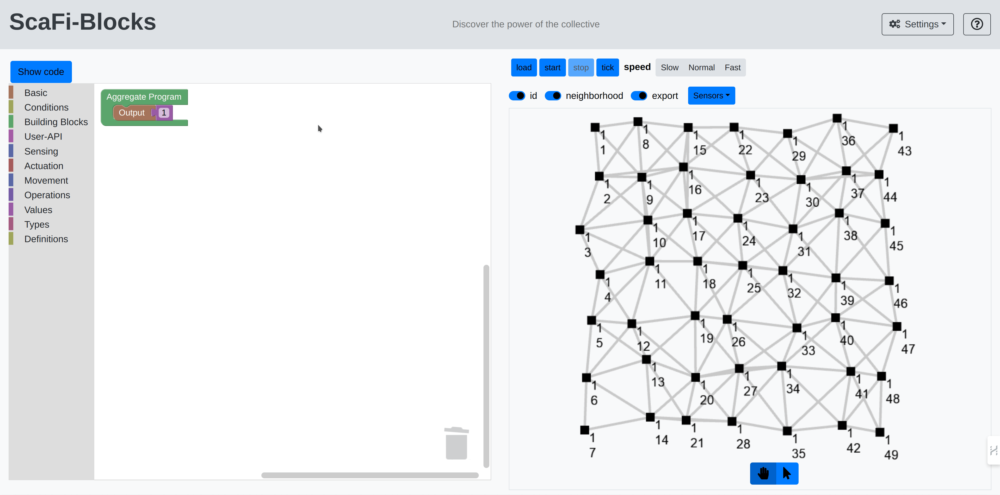
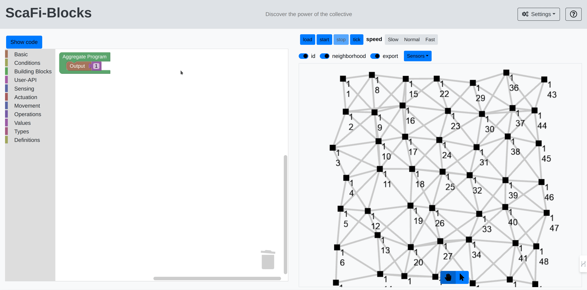
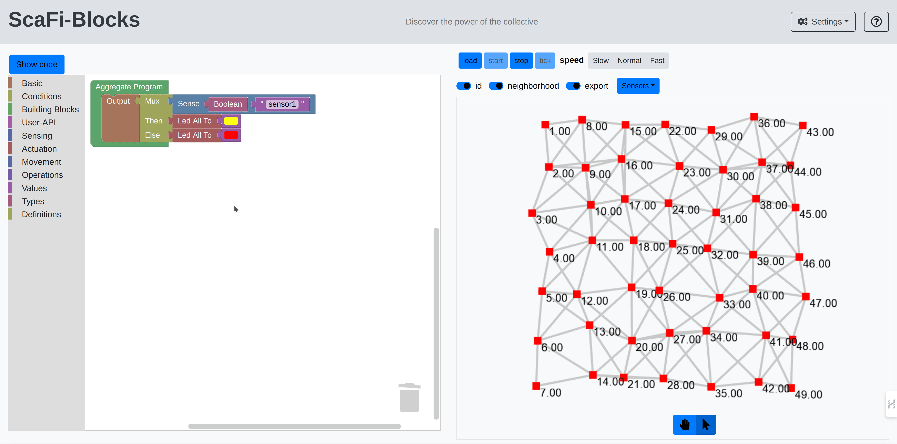
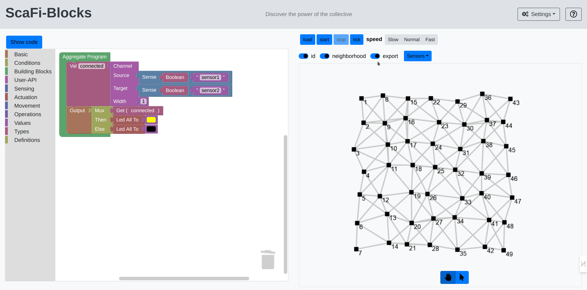

# ScaFi Web Blocks

## Overview

ScaFi Web Blocks is an online playground designed to facilitate agile experimentation with ScaFi using visual programming. 
[ScaFi](https://scafi.github.io/) itself is a framework that enables the writing of aggregated code in an intuitive and agile manner. 
This new platform aims to lower the learning curve for mastering this programming paradigm by leveraging block programming.
For this system, we select [Blockly](https://developers.google.com/blockly).

The project consists of two main parts:
- A web page, which includes [ScaFi Web](https://github.com/scafi/scafi-web) as the engine to execute ScaFi program on the web and [ScaFi Blocks](https://github.com/cric96/ScaFi-Blocks) to enable low-code programming for aggregate computing.
- A remote compilation service that translates ScaFi code into executable JavaScript.

## Getting Started

### Launching the Project

There are two ways to launch the project: by compiling and running it locally or by using Docker. We recommend the latter for ease of setup.

#### Using Docker

To run the project using Docker, execute the following command:

```
docker run -d -p 8080:8080 gianlucaaguzzi:scafi-blocks:0.0.3
```
Now, you should be able to access the project's main page at `http://localhost:8080`.

#### Using SBT

If you prefer to compile the project locally, ensure you have the following requirements:

- Node 16
- JDK 8

Then, execute the following command in your terminal:

```
sbt runService
```

This command compiles the system, producing the web page and the compilation server.
After the compilation is complete, you should be able to access the project's main page at `http://localhost:8080`.

You should see the following screen:


### Playing with the Tools

The web page is organized as follows:

- On the left, you have the area where you can write your code.
- On the right, you can control the simulation.

#### Blockly Functionality

In the left area, you can drag and drop blocks to create your program.
The blocks are organized into categories, each of them has several blocks that can be used to create your program:



Once you have selected a block, you can drag it to the main area and connect it to other blocks to create your program.


You can also remove the blocks by dragging them to the trash can.


After writing your code, you can view its textual version.



#### ScaFi Web Functionality

Once your application is ready, you can load your program by clicking the `load` button:


This sends the script to the server, compiles it, and prepares it for execution by the simulator.
To execute the program, click the `start` button (and clicking `stop` to stop the simulation):



The simulator is a grid of nodes, each of can be moved by clicking the button with the arrow, selecting an area of the grid, 
click on top of that area and dragging it to the desired position:



You can toggle some visualization options, i.e.,
- `id` to show the id of each node
- `neighbourhood` to show the neighbourhood of each node
- `export` to show the result of the program



There are other options to increase the font size and the node size by clicking the settings button:


Each node also has sensors and actuators that can be turned on and off by selecting the nodes and clicking on "sensor" to change their states.
For example, in the following video there is a sensor (called `sensor1`) that can be on and off. 
When it is off, the colour of the node is red, otherwise it is yellow.
For change the sensor, follow this video:


### Examples

#### Example 1: Gradient

This example demonstrates an aggregate program that determines the distance from a source node (an area with the `sensor1` set to true) to all other nodes. 
In this demo, we also changed the colour of the nodes based on the distance from the source node, leveraging:
- `hsl` that compute the right colour based on the distance
- `lad to all` to effectively actuate the colour change
The demo can be seen in the following video:


#### Example 2: Channel

The channel is a pattern in AC that connects a source area and a destination. 
This program can be created using ScaFi Web Blocks.
In this case, we have a source area (with `sensor1` set to true) and a destination area (with `sensor2` set to true).
The channel is created by using the `channel` block, which is a combination several gradient blocks (see the paper for more details).



#### Example 3: Basic Movement

Nodes can also be moved using a specific block called `velocity set`
This block accepts one of the blocks with the category `movement`.
In this example, we have a node that moves in a specific direction when a sensor is set to true.


There are also high level movement block like `flocking`


You can also combine the movement blocks with other standard blocks to create more complex programs.
For instance, using `leader election` with `sink at`, it is possible to create several blobs of nodes with the leader in the middle of each blob.


### Enjoy!

These are the main features of ScaFi Web Blocks. We hope you enjoy using it and that it helps you to learn and experiment with ScaFi in a fun and interactive way.
Now, let's aggregate! Combine new blocks and create new programs!
